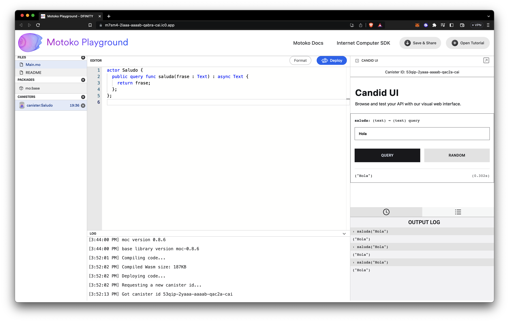

# Motoko

-   Es un **lenguaje de programación** de fuerte tipado, diseñado para **programar los Canisters** (contratos inteligentes llamados actores) de Internet Computer.
-   Está diseñado para ser **eficiente con Internet Computer** y proporciona un **ambiente de programación robusto.**
-   Su objetivo es ser **accesible para los programadores** familiarizados con otros lenguajes de programación modernos como **JavaScript, Rust, Typescript, entre otros.**
-   El **compilador, la documentación y las herramientas** son de **código abierto** y se publican bajo la licencia Apache 2.0.

## Características técnicas

<hr/>

### Generalidades

-   Admite variables que contienen **funciones, objetos, primitivas, registros, tuplas y variantes.**
-   Su **fuerte tipado** proporciona documentación verificada por el compilador en el código fuente del programa.
-   Permite la interacción con canisters generados en diferentes lenguajes de programación utilizando **Candid,** un _Interface Description Language_ autogenrado

<hr/>

### Asíncrono

-   Motoko admite el **envío de mensajes asíncronos para aplicaciones distribuidas.**
-   Los **actores Motoko encapsulan su estado y se comunican con otros actores** a través de mensajes asíncronos, asegurando el aislamiento y la distribución.
-   El sistema de tipado de Motoko garantiza la **seguridad de tipos y elimina problemas comunes de programación.**
-   Se **compila a WebAssembly** para su ejecución en Internet Computer.
-   **Código asíncrono en un estilo secuencial más sencillo** (evitando la complejidad de la programación asíncrona explícita).
-   **Comportamiento asíncrono**

    -   El programa y el entorno pueden progresar de forma independiente.
    -   Los programas pueden realizar solicitudes sin esperar al entorno y viceversa.
    -   Con `async` y `await` se definen las dependencias asíncronas

        -   `async` -> Promesas de resultados entregados en el futuro
        -   `await` -> Suspende la ejecución hasta que la promesa se completa

            ```Motoko
            actor MiActor {

            var age = 12;

            public func next() : async Nat {
                age += await Older.birthday(); // Older es otro actor
                return age;
            }
            };
            ```

<hr/>

### Modelo de actores

-   **Modelo de programación basado en actores** para contratos inteligentes de canister.
-   Los actores tienen un **estado aislado** e **interactúan a través de mensajes asíncronos.**
-   Toda la **comunicación entre actores ocurre a través de la red** utilizando el **protocolo de mensajería de Internet Computer** y permitiendo la comunicación asíncrona entre componentes.
-   Los actores pueden **comunicarse de forma concurrente,** lo que **reduce la latencia.**
-   Las **abstracciones de programación en Motoko** simplifican la **expresión de comportamientos intercalados.**

```Motoko
// El actor es similar a una clase en los lenguajes orientados a objetos
actor MiActor {}
```

<hr/>

## Ejemplo de _playground_

```
actor Saludo {
  public query func saluda(frase : Text) : async Text {
    return frase;
  };
};
```


