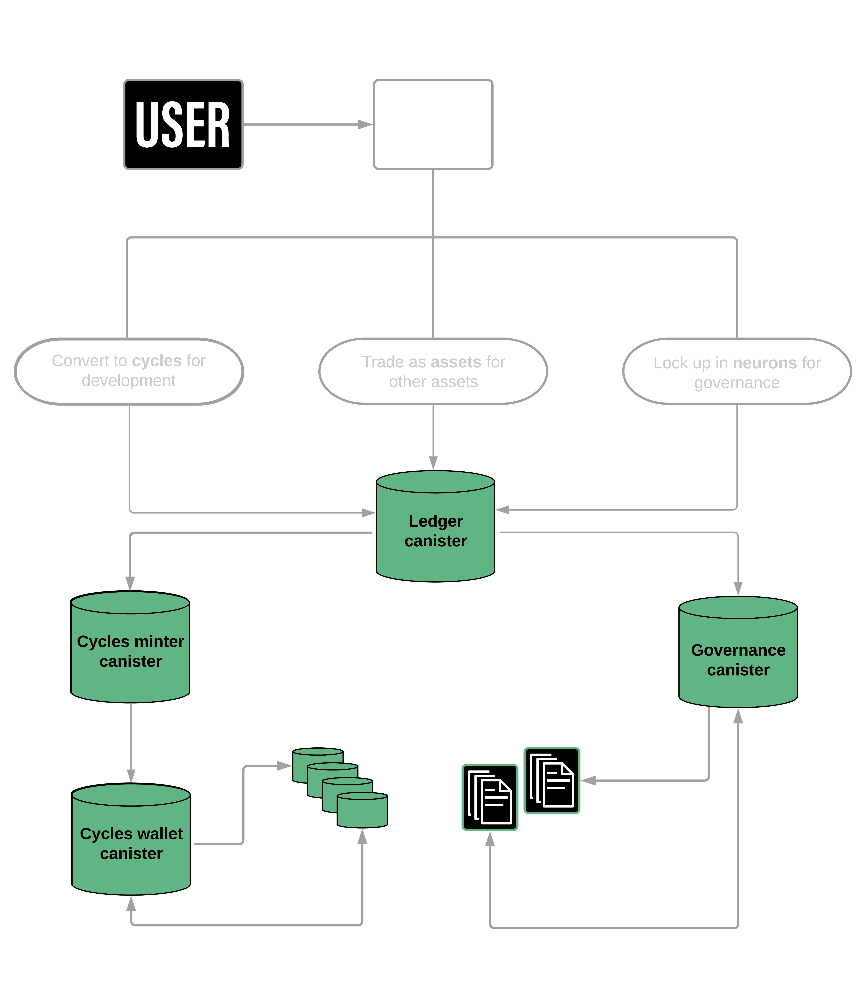

# Tokens and Cycles

-   Internet Computer Protocol tokens (ICP tokens) are native utility tokens within the Internet Computer ecosystem.
-   ICP tokens have value determined by the market and play a role in governance and economics.

<picture>
  <source media="(prefers-color-scheme: dark)" srcset="../resources/tokens-dark.png">
  
</picture>

-   _Image by [IC](https://github.com/eduairet/internet-computer-notes.git)_

## Acquiring ICP Tokens:

-   Purchase ICP tokens directly from exchanges.
-   Receive tokens as rewards for participating in Internet Computer governance.
-   Receive tokens through grants from the Internet Computer Association (ICA) or the DFINITY Foundation.
-   Receive tokens as remuneration for providing computing capacity as a node provider.

## Using ICP Tokens:

-   The usage of ICP tokens depends on individual goals and purposes.
-   Developers and founders can convert ICP tokens to cycles for running canisters.
-   Community members can lock up ICP tokens in a stake (neuron) to participate in governance and voting.

## How Cycles Work:

-   ICP tokens can be converted to cycles used to pay for resource consumption.
-   Cycles represent the costs of operations, including hardware, energy, storage, and bandwidth.
-   Canisters require cycles for communication, computation, and storage.
-   Cycles cannot be converted back to ICP tokens but can be transferred between canisters.

## Token Value and Volatility:

-   Tokens reflect the value of the Internet Computer blockchain and can fluctuate.
-   Tokens are not used to directly pay for resources to avoid affecting canister processing.
-   Tokens can be exchanged between holders and locked up in neurons for voting rights and governance participation.

## Payment to Node Providers:

-   Node providers receive compensation for active and spare nodes.
-   The governance system, the Network Nervous System, manages capacity and compensation.
